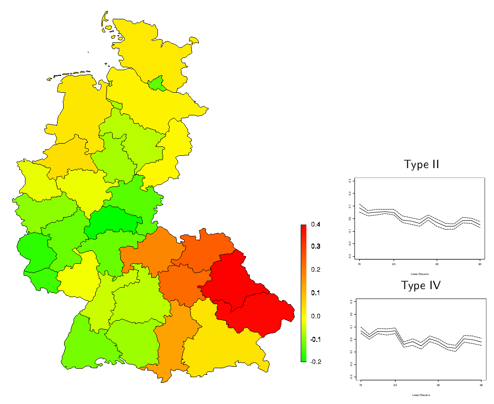

```{r setup, include=FALSE}
knitr::opts_chunk$set(echo = TRUE)
```

#  Thomas Bayes  {.allowframebreaks} 

!(pics/Thomas_Bayes.png)
Einziges Bild, vermutlich nicht authentisch}

!(pics/Image028.jpg)

## Thomas Bayes

* Priester (wie der Vater) und Mathematiker
* lebte in Tunbridge Wells (südöstlich von London)
* beeinflusst von Abraham de Moivre (frz. Mathematiker, unter anderem Thema Glücksspiel, Satz von de Moivre-Laplace = Grenzwertsatz für Bionomialverteilung)
* Drei bekannte Werke: 
      * Göttliche Barmherzigkeit, oder ein Versuch zu beweisen, dass das Ziel der göttlichen Fürsorge und Gewalt das Glück seiner Geschöpfe ist
      * Eine Einführung in die Lehre der Analysis und eine Verteidigung der Mathematiker gegen die Einwände des Autor von ``The Analyst'' (George Berkeley, anonym erschienen)
      * An Essay towards solving a Problem in the Doctrine of Chance (1763)

## Kurze Geschichtlicher Überblick

* Mitte 18. Jahrhundert: Bayes entwickelt die Bayes-Formel
* Anfang 19. Jahrhundert: Pierre-Simon Laplace entwickelt die Bayes-Formel, prägt den Begriff ''Inverse Wahrscheinlichkeit''
* Anfang 20. Jahrhundert: Ronald Fisher entwickelt den Frequentismus, Maximum-Likelihood-Schätzer, prägt den Begriff ''Bayes-Statistik''
* Ende des 20. Jahrhunderts: Bayes-Verfahren werden wieder aktuell, komplexe Modelle dank Computer möglich

Literatur:  Stephen E. Fienberg: When Did Bayesian Inference Become
''Bayesian''? Bayesian Analysis (2006) 1(1), pp. 1–40.*

# Bayes und die Billardkugeln
## An Essay towards solving a Problem in the Doctrine of Chance (1763)

Eine weiße Billiardkugel wird auf eine Gerade der Länge 1 gerollt. Die Wahrscheinlichkeit dafür, dass sie an einem Punkt $\pi$ zu liegen kommt, ist konstant für alle $\pi \in [0,1]$. Eine rote Kugel wird unter den selben Bedinungen $n$-mal gerollt. Sei $x$ die Zahl der Versuche, in denen die rote Kugel links von der ersten Kugel, also links von $\pi$ zu liegen kommt.

Welche Information über $\pi$ erhalten wir aus der Beobachtung $x$?

## Billiardkugeln

Sei die weiße Kugel bereits gerollt und liege auf dem Punkt $\pi$. Die rote Kugel gerollt. Dann ist die Wahrscheinlichkeit, dass die rote Kugel links von der weißen zu liegen kommt gleich $\pi$. Rollen wir $n$-mal, so handelt es sich um ein Binomialexperiment mit Erfolgswahrscheinlichkeit $\pi$. Gegeben $\Pi=\pi$ ist also:
$$
P(X=x|\Pi=\pi)=f(x|\pi)={{n}\choose{x}}\pi^x(1-\pi)^{n-x}.
$$

Um nun mit dem Satz von Bayes eine Aussage über $pi$ gegeben $x$ zu machen, brauchen wir $f(\pi)$. Was wissen wir  über $\pi$ vor der Beobachtung?

## Priori und Posteriori

Annahme: Vor der Beobachtung, lateinisch \textit{a priori}, wissen wir nichts über $\pi$. Wir folgen dem Prinzip von unzureichenden Grund und nehmen $\pi \sim U[0,1]$. 

Dann erhalten wir nach der Beobachtung, lateinisch \textit{a posteriori}, mit dem Satz von Bayes
\begin{eqnarray}
f(\pi|x)&=&\frac{f(x|\pi)f(\pi)}{\int{f(x|\tilde\pi)f(\tilde\pi)d\tilde\pi}} = \frac{{{n}\choose{x}}\pi^x(1-\pi)^{n-x}\cdot 1}{f(x)} \nonumber\\
&=& C(x) \cdot \pi^x (1-\pi)^{n-x} = C(x) \cdot \pi^{(x+1)-1} (1-\pi)^{(n-x+1)-1} \label{eq:postbilliard}
\end{eqnarray}
Dabei ist $C(x)$ eine Konstante bezüglich $\pi$ (hängt nicht von $\pi$, nur von $x$ ab). (\ref{eq:postbilliard}) sieht bis auf die Konstante aus wie die Dichte der Beta$(x+1,n-x+1)$-Verteilung. Wir sagen: $\pi^{(x+1)-1} \pi^{(n-x+1)-1}$ ist der ''Kern'' der Beta-Verteilung.

## Zusammenfassung

* Wir haben Vorwissen über die Wahrscheinlichkeit $\pi$ in Form einer **Priori-Verteilung** bzw. Priori -Dichte formuliert.
* Nach der Beobachtung $x$ wissen wir mehr über $\pi$; wir haben die \textbf{Posteriori-Verteilung} bzw. Posteriori-Dichte erhalten.
* Bayes-Prinzip: Alle Schlüsse werden aus der Posteriori-Verteilung gezogen.
* Zur Berechnung der Posteriori brauchen wir zudem das Beobachtungsmodell bzw. \textbf{Datendichte} $f(x|\pi)$ (auch als Likelihood bezeichnet)
* und die \textbf{Normalisierungskonstante} (auch marginale Likelihood), die wir hier nicht explizit berechnen mussten.


## Priori und Posteriori

\includegraphics[scale=.4]{pics/betapost.png}

# Bayesianische Inferenz
## Bayesianische Inferenz
\begin{itemize}
\item Wir beobachten $n$ Daten $x_i$, die aus einem Zufallsprozess entstanden sind
\item \textbf{Annahme}: $x_i$ ist die Realisierung einer Zufallsvariable $X_i$
\item \textbf{Annahme}: $X_i$ hat Verteilung $F$ mit Dichte $f(x)$
\note{Wir brauchen die Dichte! Wie bei Likelihood-Inferenz!\\
Abweichungen davon möglich (z.B. Maximum Entropy Methoden, Quasi-Likelihood)\\
Dichte kommt aus dem (statistischen) Modell}
\item \textbf{Parametrische Annahme}: Die Dichte ist bekannt bis auf einen Parameter $\theta$: $f(x|\theta)$
\item $\theta$ ist unbekannt und die Information über $\theta$ lässt sich in Form einer Wahrscheinlichkeitsverteilung mit Dichte darstellen
\item Vor der Beobachtung (\textit{a priori}) ist unsere Information $p(\theta)$ 
\item Durch Beobachtung erhalten wir mehr Information, ausgedrückt durch die \textit{a posteriori}-Verteilung $\theta|x$
\item Sowohl $x$ als auch $\theta$ können mehrdimensional sein!
\end{itemize}

## Aufgaben in der Bayesianischen Inferenz
\begin{itemize}
\item Festlegung des statistischen Modells für $x$, Datendichte (Likelihood) $f(x|\theta)$ 
\note{Einfachstichprobe, identisch, iid., Regressionsmodell?\\}
\item Festlegung des \textit{a priori}-Wissens über $\theta$, Priori-Dichte $p(\theta)$  
\note{Konjugierte Priori, nicht-informative Priori, subjektive Priori, imprompere Priori\\}
\item Berechnung der Posteriori $p(\theta|x)$ (insbesondere Normalisierungskonstante)
\note{Analytisch, Approximation, Monte-Carlo}
\end{itemize}

## Bayes-Prinzip
\begin{itemize}
\item Die Dichte der Posteriori-Verteilung erhalten wir über die Bayes-Formel
\end{itemize}
\begin{center}
\LARGE
$f(\theta|x) = \frac{f(x|\theta) \cdot f(\theta)}{\int f(x|\tilde\theta) f(\tilde\theta) d\tilde\theta}$
\end{center}
\begin{itemize}
\item Bayes-Prinzip: Alle Schlüsse werden \textbf{nur} aus der Posteriori-Verteilung gezogen
\end{itemize}

## Punktschätzer
Billiard-Kugel-Beispiel: sei $n=30$ und $x=5$. Wie lautet dann unser Schätzer für $\pi$? 
\begin{itemize}
\item Posteriori-Erwartungswert: Nach Beobachtung von $x$, welchen Wert erwarten wir für $\pi$?\\
$$ E(\pi)=\frac{x+1}{n+1}=\frac{6}{31}\approx 0.194$$
\item Posteriori-Modus: Welcher Wert von $\pi$ maximiert die Posteriori?
$$ \hat{\pi}_{\text{MAP}}=\frac{x}{n}=\frac{5}{30} \approx 0.167$$
\item Posteriori-Median: Welcher Wert hat die mittlere Wahrscheinlichkeit?
$$ \hat{\pi}_{\text{med}}\approx 0.181$$
\end{itemize}

## Kredibilitätsintervall
Aus der Posteriori-Verteilung lässt sich ein Intervall $[\theta_u, \theta_o]$ bestimmen, das den Parameter $\theta$ mit Wahrscheinlichkeit $(1-\alpha)$ enthält.

Ein Intervall $I = [\theta_u, \theta_o]$, für das gilt
\[ 
\int_{\theta_u}^{\theta_o} p(\theta|x)d\theta = 1-\alpha
\]
nennt man $(1-\alpha)$-\textbf{Kredibilitätsintervall}.

## HPD-Intervall
Kredibilitätsintervalle sind nicht eindeutig. 

> Ein $(1-\alpha)$-Kredibilitätsintervall $H$ heisst \textbf{Highest Posteriori Density Interval (HPD-Intervall)}, wenn für alle $\theta \in H$ und alle $\theta^* \not\in H$ gilt:
\[ p(\theta|x) \geq p(\theta^*|x) \]

## Beispiel: Kredibilitätsintervalle Betabinomialmodell
\centering
\includegraphics[scale=.5]{pics/KI-Betabinomial.pdf}
\end{Bsp}
}
\note{Länge der Intervalle: 0.5102 und 0.505}

## Prädiktive Posterioriverteilung
> Die Dichte der \textbf{Prädiktiven Posteriori-Verteilung} lautet
\[
p(x_Z|x)=\int_\Theta p(x_Z,\theta|x) d\theta = \int p(x_Z|\theta)p(\theta|x) d\theta 
\]

Die prädiktive Posteriori-Verteilung ermöglicht die Prognose von $x$ zum Zeitpunkt $Z$. Es gilt:
\begin{eqnarray*}
E(x_Z|x) &=& E(E(x_Z|\theta,x))\\
Var(x_Z|x)&=& E(Var(x_Z|\theta,x))+Var(E(x_Z|\theta,x))
\end{eqnarray*}

## Aufgaben in der Bayesianischen Inferenz
``Bayes-Prinzip: Alle Schlüsse werden **nur** aus der Posteriori-Verteilung gezogen'' -- Was machen wir nun mit der Posteriori?
\begin{itemize}
\item Grundsätzlich: Komplette Posteriori wichtig (Darstellung bei hochdimensionalem Parameter $\theta$ aber schwierig)
\item Punktschätzer (Posterior-Erwartungswert, Maximum-a-Posteriori-Schätzer, Posteriori-Modus)
\item Intervallschätzer
\item Testen
\item Modellvergleich (d.h. verschiedene Annahmen für $f(x)$!)
\item Prädiktion
\end{itemize}

# Bayesianische Modellierung

## Normalverteilungsmodel

Gegeben seien $n$ unabhängig normalverteilte Beobachtungen
$$ 
X_i \sim  N(\mu,\sigma^2), i=1,\ldots,n.
$$ 
Die gemeinsame Datendichte lautet
\begin{eqnarray*}
f(x|\theta) &=& \prod\left(f(x_i|\theta)\right) \\
&=& \left(\frac{1}{\sigma\sqrt(2\pi)}\right)^n \exp\left(-\frac{1}{2\sigma^2}\sum_{i=1}^n (x_i-\mu)^2\right)
\end{eqnarray*}

## $\sigma^2$ bekannt

Konjugierte Priori $\mu\sim N(\mu_0,\sigma_0^2)$. Damit ist die Posteriori
\begin{eqnarray*}
\mu|(x_1,\ldots,x_n) &\sim &N(m/s,1/s)\\
m&=&\frac{\mu_0}{\sigma_0^2} + \frac{\sum_{i=1}^n x_i}{\sigma^2}\\
s &=& \frac{1}{\sigma_0^2} + \frac{n}{\sigma^2}
\end{eqnarray*}

Jeffreys Priori: $p(\mu)\propto$ const. entspricht $\sigma^2_0\to\infty$.

## $\mu$ bekannt
Konjugierte Priori: $\sigma^2\sim IG(a,b)$ führt zur Posteriori
\[
\sigma^2|(x_1,\ldots,x_n) \sim IG\left(a+n/2, b+0.5\sum_{i=1}^n{(x_i-\mu)^2}\right)
\]

Jeffreys Priori $p(\sigma^2)\propto\sigma^{-1}$ entspricht ''IG(0,0)''.

## $\mu$ bekannt (Alternativ)

Alternativ lässt sich die Inferenz für die Präzision gleich Inverse der Varianz betreiben:
$$ \tau=\sigma^{-2}. $$
Die konjugierte Priori ist dann die Gamma-Verteilung
\[
p(\tau) = \frac{b^a}{\Gamma(a)}\tau^{a-1}\exp{-b\tau}.
\]
Die Posteriori lautet
$$
p(\tau|x)\propto \tau^{n/2}\exp\left(-\tau/2\sum_{i=1}^n(x-\mu)^2\right)\cdot\tau^{a-1}\exp(-b\tau),
$$
ist also die Ga($a+n/2, b+0.5\sum_{i=1}^n{(x_i-\mu)^2}$)-Verteilung.

## Normalverteilungsmodell mit zwei unbekannten Parametern

Bei jeweils einem unbekanntem Parameter und unter Benutzung der konjugierten Verteilung kennen wir die Posteriori vollständig. Im Folgenden seien beide Parameter ($\mu$ und $\tau$) unbekannt.

Wir wollen die selben Prioris wie oben benutzen und gehen von \textit{a priori}-Unabhängigkeit der Parameter aus:
$$ p(\mu,\tau)=p(\mu)\cdot p(\tau) $$

Die Posteriori lautet bis auf Konstanten:
\begin{eqnarray*}
p(\mu,\tau|x)&\propto& \exp\left(-\tau_0/2 (\mu-\mu_0)^2\right)\\
&&\cdot\tau^{n/2}\exp\left(-\tau/2\sum_{i=1}^n(x-\mu)^2\right)\cdot\tau^{a-1}\exp(-b\tau)
\end{eqnarray*}

Dabei handelt es sich nicht um eine bekannte zweiparametrische Verteilung.

## Bedingte Posteriori
Wir betrachten die bedingte Posteriori eines Parameters, z.B. $p(\mu|\tau,x)$. Nach der Definition der bedingten Dichte gilt
\[
p(\mu|\tau,x)=\frac{p(\mu,\tau|x)}{p(\tau|x)}\propto p(\mu,\tau|x)
\]
Hier also: Die bedingte Posteriori-Dichte von $\mu$ gegeben $\tau$ ist die Normalverteilung. Das ergibt sich automatisch aus dem Normalverteilungsmodell mit bekannter Varianz!

Die bedingte Posteriori hilft uns aber nicht weiter, weil wir den Parameter $\tau$ nicht kennen.

## Vollständig bedingte Posteriori

> Sei $\bf{\theta}=(\theta_1,\ldots\theta_p)$. Als vollständig bedingte Posteriori (''full conditional posterior'') bezeichnen wir die Verteilung eines Parameters $\theta_i$ gegeben allen anderen Parametern $\theta_{-i}$ und den Daten $x$. Es gilt:
$$
 p(\theta_i|\theta_{-i},x)\propto p(\bf{\theta}|x).
$$

## Semikonjugierte Priori
Eine Familie $\mathcal{F}$ von Verteilungen auf $\Theta$ heißt **semikonjugiert** wenn für jede Priori $p(\theta)$ auf $\mathcal{F}$ die vollständig bedingte Posteriori $p(\theta_i|\theta_{-i},x)$ ebenfalls zu $\mathcal{F}$ gehört. 

## Marginale Posteriori

Wir betrachten die marginale Posteriori eines Parameters, also z.B. $p(\tau|x)$. Diese erhalten wir durch marginalisieren der gemeinsamen Posteriori
$$ 
p(\tau|x)=\int p(\mu,\tau|x) d\mu. 
$$
Alternativ kann man folgende Formel ausnutzen
$$
p(\tau|x)=\frac{p(\mu,\tau|x)}{p(\mu|\tau,x)}
$$

Interessiert uns in mehrparametrischen Modellen nur ein Parameter, so ziehen wir die Schlüsse aus der marginalen Posteriori (*Model averaging*).


# Regression

## Lineare Regression

Übliches Lineares Regressionsmodell:
\begin{eqnarray*}
y_i&=&\alpha+\beta x_i+\epsilon_i\\
{\rm E}(\epsilon)&=&0\\
{\rm Var}(\epsilon)&=&\sigma^2\\
{\rm Cov}(\epsilon_i,\epsilon_j)&=&0\\
\end{eqnarray*}

## Bayesianisches lineares Regressionsmodell
\begin{eqnarray*}
y_i &\sim & {\rm N}(\alpha+\beta x_i,\sigma^2)\\
\alpha&\sim&{\rm N}(m_\alpha,v_\alpha^2)\\
\beta &\sim&{\rm N}(m_\beta,v_\beta^2)
\end{eqnarray*}
Bei festem $\sigma^2$ sind dies die konjugierten Prioris.
Wir kennen allerdings $\sigma^2$ in der Regel nicht. Wir nehmen zusätzlich an:
$$
\sigma^2 \sim IG(a,b)
$$

#Generalisierte Lineare Regression

## Bayesianisches generalisiertes lineares Regressionsmodell

Das Modell lässt sich relativ einfach auf beliebige Verteilungen verallgemeinern, z.B. ein Poisson-Modell
\begin{eqnarray*}
y_i &\sim& Po(\lambda_i)\\
\log(\lambda_i) &=& \alpha+\beta x_i\\
\alpha&\sim&{\rm N}(m_\alpha,v_\alpha^2)\\
\beta &\sim&{\rm N}(m_\beta,v_\beta^2)
\end{eqnarray*}
Die (vollständig bedingten) Posterioris sind jedoch keine Standardverteilungen mehr.

$$ f(y_i|\lambda) = \frac{\lambda_i^{y_i}}{y_i!}\exp{-\lambda_i}$$
$$ \lambda_i=\exp(\alpha+\beta x_i) $$

# Multivariate Regression
## Multivariate Normal-Regression

\begin{eqnarray}
y_i &\sim & {\rm N}(\mathbf{x}_i\boldsymbol\beta,\sigma^2)\\
\sigma^2&\sim&IG(a,b)\\
{\boldsymbol\beta} &\sim&{\rm N}(\mu_0,\boldsymbol\Lambda^{-1}_0)
\end{eqnarray}

## Posteriori

\begin{eqnarray*}
p(\boldsymbol\beta,\sigma^{2}|\mathbf{y}) &\propto& f(\mathbf{y}|\boldsymbol\beta,\sigma^{2})p(\boldsymbol\beta)p(\sigma^{2})\\
&\propto&  (\sigma^{2})^{-n/2} \exp\left(-\frac{1}{2{\sigma}^{2}}(\mathbf{y}- \mathbf{X} \boldsymbol\beta)^{\rm T}(\mathbf{y}- \mathbf{X} \boldsymbol\beta)\right)\\
&\cdot&     |\boldsymbol\Lambda_0|^{1/2} \exp\left(-\frac{1}{2}(\boldsymbol\beta -\boldsymbol\mu_0)^{\rm T} \boldsymbol\Lambda_0 (\boldsymbol\beta - \boldsymbol\mu_0)\right)\\
&\cdot&  (\sigma^2)^{-(a_0+1)} \exp\left(-\frac{b_0}{{\sigma}^{2}}\right)
\end{eqnarray*}

$$ 
p(\beta|\sigma^2,\mathbf{y}) \propto \exp\left(-\frac{1}{2}\boldsymbol\beta^{\rm T}({\sigma}^{2}\mathbf{X}^{\rm T}
\mathbf{X}+\boldsymbol\Lambda_0)\boldsymbol\beta + (\sigma^2\mathbf{y}^{\rm T}\mathbf{X}+\boldsymbol
\mu_0^{\rm T}\boldsymbol \Lambda_0)\boldsymbol \beta)\right) 
$$

## Full conditionals

Damit 
\begin{eqnarray*}
\boldsymbol\beta|\sigma^2,\mathbf{y},\mathbf{x} &\sim& N(\boldsymbol\mu_n,\sigma^2\boldsymbol\Lambda_n^{-1})\\
\sigma^2|\boldsymbol\beta,\mathbf{y},\mathbf{x}&\sim& IG(a_n,b_n)\\
\boldsymbol\mu_n&=&(\sigma^2\mathbf{X}^{\rm T}\mathbf{X}+\boldsymbol\Lambda_0)^{-1} (\boldsymbol\Lambda_0\boldsymbol\mu_0+\sigma^2\mathbf{y}^{\rm T}\mathbf{X}\hat{\boldsymbol\beta})\\
\boldsymbol\Lambda_n&=&(\sigma^2\mathbf{X}^{\rm T}\mathbf{X}+\boldsymbol\Lambda_0) \\
a_n&=&a_0+\frac{n}{2}\\
b_n&=&b_0+\frac{1}{2}(\mathbf{y}^{\rm T}\mathbf{y}+\boldsymbol\mu_0^{\rm T}\boldsymbol\Lambda_0\boldsymbol\mu_0-\boldsymbol\mu_n^{\rm T}\boldsymbol\Lambda_n\boldsymbol\mu_n) 
\end{eqnarray*}

## Random Walk Priori
Über die Kovarianz- oder die Präzisionsmatrix lassen sich Korrelationen zwischen den Kovariableneffekten modellieren. Z.B. ein zeitlich geglätterer Trend.

**Beispiel: Random Walk**
Gegeben sei eine Zeitreihe $y_t$ mit $t=1,\ldots,T$. Wir wollen die Zeitreihe glätten. Sei $\mathbf{X}=\mathbf{I}_T$, dann ist obiges Modell gleich
$$y_t =\beta_t + \epsilon_t \text{ für }t=1,\ldots,T$$
Als Priori für $\beta$ nehmen wir einen ''Random Walk'':
\begin{eqnarray*}
\beta_1 &\sim &N(0,\tau_0^2)\\
\beta_t &\sim &N(\beta_{t-1},\tau^2)\\
\end{eqnarray*}
Der Parameter $\tau$ steuert die \textit{Glattheit} der Zeitreihe $\beta_t$.


## Präzisionsmatrix
Es lässt sich zeigen (mit $\tau_0\to \infty$): 
$$ \Lambda = \tau^{-2}\left(\begin{array}{ccccccc}
1 & -1 & 0 & \cdots & & & 0\\
-1 & 2 & -1 & 0 & \cdots & & 0\\
0 & -1 & 2 & -1 & 0 & \cdots & 0\\
\vdots & & & \ddots & \ddots& \ddots & \vdots \\
& &  \cdots & 0 & -1 & 2 & -1 \\
& & & \cdots & 0 & -1 & 1
\end{array}\right) $$

!(pics/globalwarming-rw.png)

# Hierarchische Modellierung

## Hierarchische Bayesianische Modelle

* Level 1: Datenmodell, Definition der Likelihood
* Level 2: Priori-Modell der unbekannten Parameter
* Level 3: (Hyper-)Prioris der Prioriparameter in Level 2

Kann an sich beliebig erweitert werden, i.d.R. reichen aber drei Level. Inferenz üblicherweise mit MCMC.

## Beispiel: Räumliches APC-Modell

Anzahl männliche Magenkrebstote in Westdeutschland

* Jahre 1976 - 1990
* 13 Altersgruppen a 5 Jahre (15-19 bis 85-89)
* Geburtskohorten von 1896-1975
* 30 Regierungsbezirke


## Hierarchisches Bayes-Modell: Level 1
$$ \begin{aligned}
y_{ijt} &\sim \mbox{B}(n_{ijt},\pi_{ijt})\\
\mbox{logit}(\pi_{jtl}) &=& \xi_{jtl} \\ 
&= \mu + \theta_j + \phi_t + \psi_k + \alpha_l + \left[
\begin{array}{c}
\delta_{jl} \\
\delta_{kl}
\end{array}
\right] + z_{jtl}
\end{aligned} $$

## Hierarchisches Bayes-Modell: Parameter

* $\mu$: Intercept (1 Parameter)
* $\theta_j$: Effekt der Altersgruppe $j$ (15 Parameter)
* $\phi_t$: Effekt der Periode $t$ (13 Parameter)
* $\psi_k$: Effekt der Kohorte $k=k(j,t)$ (75 Parameter)
* $\alpha_l$: Räumlicher Effekt $l$ (30 Parameter)
* $\delta_{tl}$: Interaktion zwischen Perioden- und räumlichen Effekt (390 Parameter)
* $z_{jtl}$: zufälliger Effekt (Überdispersion, 5850 Parameter)

## Hierarchisches Bayes-Modell: Level 2

* Random Walk Priori für APC-Effekte mit Glättungsparameter (Präzision)
* 2D-Random-Walk (Gauss-Markovzufallsfeld) für räumlichen Effekt mit Glättungsparameter
* Interaktion: Unabhängiger Random Walk pro Region oder 3D-GMZF mit Glättungsparameter
* iid normalverteilter zufälliger Effekt mit unbekannter Varianz/Präzision

Alle Prioris haben die Form
$$
p({\bf \theta}|\kappa) \propto \exp \left(- \frac{\kappa}{2} \, {\bf \theta}^T {\bf K}_{\theta}
{\bf \theta} \right)
$$

## Hierarchisches Bayes-Modell: Level 3
Gamma-Prioris auf alle Präzisionsparameter. Hyperprioriparameter können Ergebnis beeinflußen $\to$ Sensitivitätsanalyse.

* Sehr komplexe Posteriori
* Marginale Posterioris nicht geschlossen herleitbar
* Bedingte Posterioris leicht anzugeben und (mit Trick) Standardverteilungen

## Ergebnisse {.allowframebreaks}




